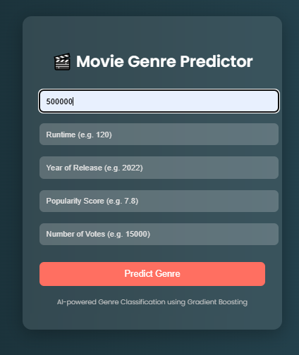

#  Movie Genre Predictor

This project uses **Gradient Boosting** to predict the **genre of a movie** based on input features like budget, runtime, popularity score, vote average, and number of votes.

##  Tech Stack

- Python
- Flask
- Scikit-learn
- Gradient Boosting Classifier
- HTML + CSS (Frontend)

##  Project Structure

```
gradient_boosting_movie_predictor/
│
├── app.py                  # Flask backend app
├── model/
│   └── train_model.py      # Script to train and save the model
│   └── gb_model.pkl        # Trained model (generated)
├── templates/
│   └── index.html          # Frontend UI
├── dataset/
│   └── movie_dataset.csv   # Input dataset
├── readme.md
├── requirements.txt
```

##  How to Run

1. Clone the repository.
2. Install dependencies:
   ```
   pip install -r requirements.txt
   ```
3. Train the model:
   ```
   python model/train_model.py
   ```
4. Run the app:
   ```
   python app.py
   ```
5. Visit `http://localhost:5000` to test the app.

##  Dataset Features

Make sure your `movie_dataset.csv` has the following columns:

- `budget`
- `runtime`
- `popularity`
- `vote_average`
- `vote_count`
- `Genre` (target)

##  Frontend Preview

Step1:

---


